# Caco-2 Permeability Prediction Using Machine Learning

A reproducible machine-learning workflow for predicting **Caco-2 intestinal permeability** from molecular structure using RDKit molecular descriptors and Morgan fingerprints.

The project combines molecular representation, Random Forest regression, cross-validation, out-of-fold prediction, residual analysis, SHAP explainability, Morgan fingerprint interpretation, and scaffold-based validation.

---

## Project Overview

Caco-2 permeability is an important ADMET property used during early-stage drug discovery to assess the ability of compounds to cross an intestinal epithelial cell model.

This project investigates whether molecular structure can be used to predict experimentally measured Caco-2 permeability using classical machine-learning methods.

Three molecular representations were evaluated:

1. **RDKit physicochemical descriptors**
2. **Morgan circular fingerprints**
3. **Combined RDKit descriptors + Morgan fingerprints**

The workflow was designed to provide not only predictive performance but also **model interpretation and chemical insight**.

---

## Dataset

The project uses the **Caco-2 Wang dataset** from the Therapeutics Data Commons (TDC).

The processed dataset contains:

* **910 molecules**
* **3 original columns:** Drug_ID, Drug, Y
* **906 unique molecular structures**
* **0 completely duplicated rows**
* **0 invalid molecular structures detected during scaffold validation**

The target variable is the experimentally measured Caco-2 permeability value (`Y`).

The raw dataset is stored in:

```text
data/raw/caco2_wang.csv
```

The original downloaded dataset is also retained as:

```text
data/caco2_wang.tab
```

### Dataset identity note

The original `Drug_ID` field contains repeated identifiers for some entries. This does not necessarily represent duplicated molecular structures. Direct comparison of the molecular structure field showed only **4 duplicated structures**, corresponding to **8 rows**.

Therefore, the molecular structure rather than `Drug_ID` was used as the primary structural identity for analysis.

---

# Molecular Representation

## RDKit Molecular Descriptors

Eight molecular descriptors were calculated using RDKit:

| Descriptor   | Description                             |
| ------------ | --------------------------------------- |
| MW           | Molecular weight                        |
| LogP         | Lipophilicity                           |
| HBD          | Hydrogen-bond donors                    |
| HBA          | Hydrogen-bond acceptors                 |
| TPSA         | Topological polar surface area          |
| RotBonds     | Number of rotatable bonds               |
| Rings        | Ring count                              |
| FractionCSP3 | Fraction of sp3-hybridized carbon atoms |

The processed descriptor dataset is available at:

```text
data/processed/caco2_rdkit_features.csv
```

Descriptor generation is implemented in:

```text
src/02_generate_descriptors.py
```

---

## Morgan Fingerprints

Morgan circular fingerprints were generated to capture local molecular structure.

The fingerprint representation contains **2048 binary features**:

```text
Bit_0
Bit_1
...
Bit_2047
```

Morgan fingerprints encode atom-centered molecular environments within a specified radius. They provide a structural representation that complements the global physicochemical descriptors.

The processed fingerprints are available at:

```text
data/processed/caco2_morgan_fingerprints.csv
```

Fingerprint generation is implemented in:

```text
src/03_generate_morgan.py
```

---

# Machine-Learning Model

A **Random Forest Regressor** was used for the prediction task.

The model was configured with:

```text
n_estimators = 300
random_state = 42
n_jobs = -1
```

Three feature representations were compared:

```text
RDKit Descriptors
Morgan Fingerprints
Combined Descriptors + Morgan Fingerprints
```

Model comparison is implemented in:

```text
src/04_model_comparison.py
```

---

# Cross-Validation

Model performance was evaluated using **5-fold cross-validation** with:

```text
KFold(
    n_splits=5,
    shuffle=True,
    random_state=42
)
```

The following metrics were calculated:

* R²
* RMSE
* MAE

The mean and standard deviation across the five folds were retained.

---

# Model Performance

The three molecular representations produced the following results.

| Model                             |    Mean R² |     Std R² |  Mean RMSE |   Std RMSE |   Mean MAE |    Std MAE |
| --------------------------------- | ---------: | ---------: | ---------: | ---------: | ---------: | ---------: |
| RDKit Descriptors                 | **0.7159** |     0.0297 |     0.4114 |     0.0217 |     0.3182 |     0.0103 |
| Morgan Fingerprints               |     0.6612 |     0.0504 |     0.4483 |     0.0344 |     0.3356 |     0.0243 |
| **Combined Descriptors + Morgan** | **0.7455** | **0.0258** | **0.3895** | **0.0217** | **0.3005** | **0.0148** |

The combined molecular representation produced the strongest overall performance.

Compared with the descriptor-only model, adding Morgan fingerprints improved the mean cross-validated R² from:

```text
0.7159 → 0.7455
```

and reduced mean RMSE from:

```text
0.4114 → 0.3895
```

The model comparison results are stored in:

```text
results/caco2_model_comparison.csv
```

The corresponding visualization is:

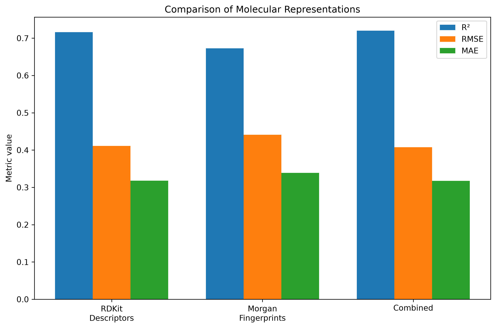

---

# Out-of-Fold Evaluation

In addition to the mean cross-validation scores, out-of-fold predictions were generated for all **910 molecules**.

Each molecule was predicted by a model that did not use that molecule during training.

This provides a more direct estimate of prediction performance across the complete dataset.

### Out-of-fold performance

| Metric        | OOF Performance |
| ------------- | --------------: |
| Molecules     |         **910** |
| R²            |      **0.7230** |
| RMSE          |      **0.4089** |
| MAE           |      **0.3177** |
| Residual Mean |     **-0.0216** |
| Residual Std  |      **0.4085** |

The out-of-fold predictions are stored in:

```text
results/caco2_combined_oof_predictions.csv
```

The file contains:

```text
Drug_ID
Experimental_Y
OOF_Predicted_Y
Residual
```

---

## Predicted vs Experimental Values

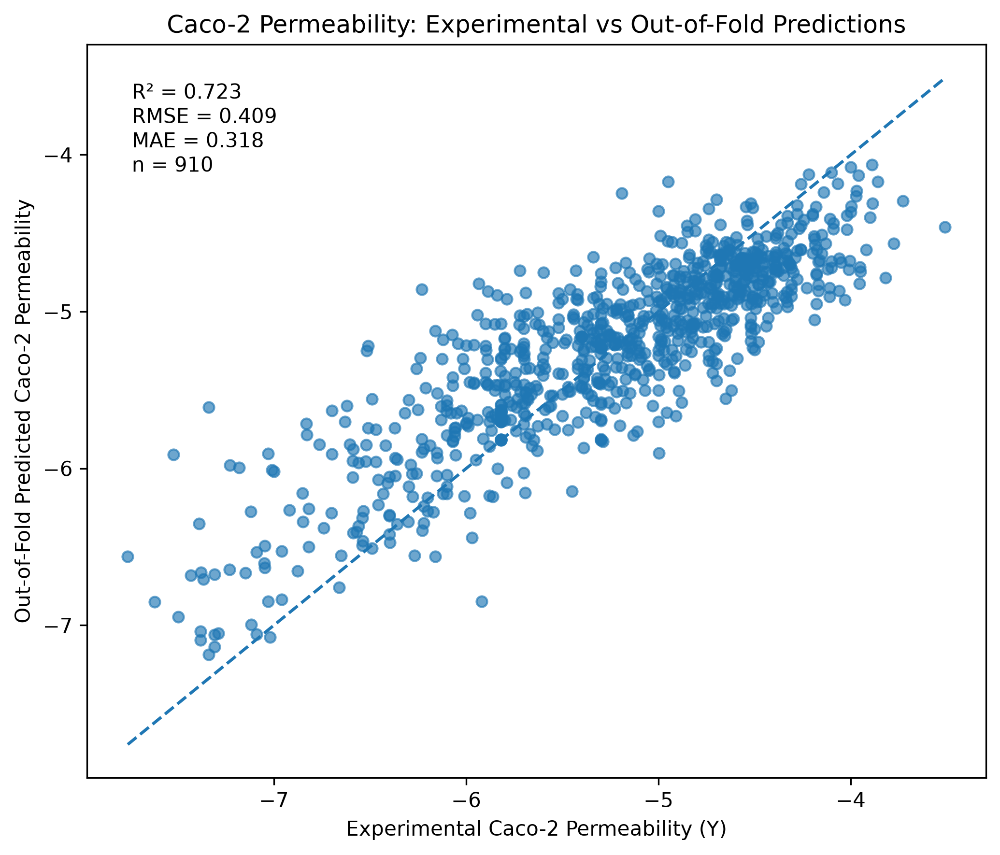

The predicted-versus-experimental plot provides a visual assessment of agreement between the model predictions and experimental measurements.

---

# Residual Analysis

Residuals were calculated as:

```text
Residual = Experimental Y - Predicted Y
```

The out-of-fold residual distribution had:

```text
Mean = -0.0216
Std  = 0.4085
```

The residual mean is close to zero, indicating limited overall systematic bias.

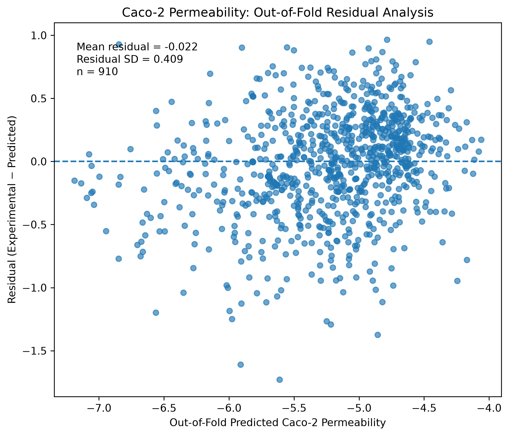

Residual analysis was used to identify prediction errors and assess whether the model exhibited substantial systematic deviations.

---

# Cross-Validation Stability

The distribution of the five-fold R² scores was examined to assess variation between folds.

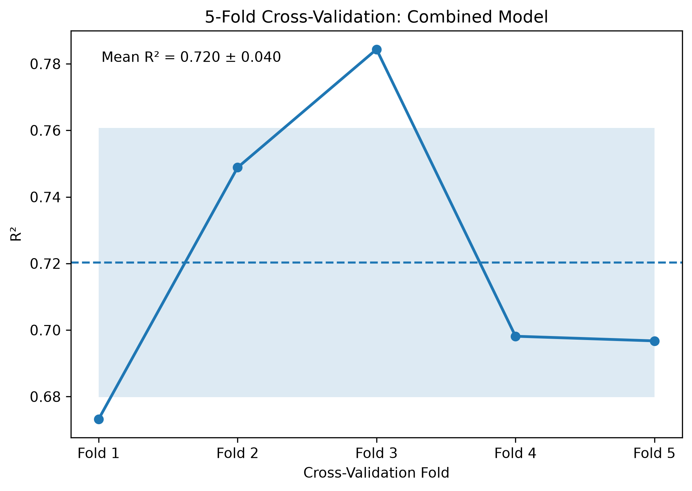

The combined representation produced:

```text
Mean R² = 0.7455
Std R²  = 0.0258
```

The relatively small standard deviation indicates reasonably consistent performance across the random cross-validation folds.

---

# Model Interpretation

Model interpretation was performed using two complementary approaches:

1. **SHAP analysis of molecular descriptors**
2. **Morgan fingerprint interpretation**

SHAP provides insight into how molecular properties contribute to individual predictions, while Morgan analysis investigates recurring local structural environments represented by the fingerprint.

---

# SHAP Interpretation

SHAP was used to investigate the contribution of molecular descriptors to model predictions.

The analysis focused on the eight RDKit descriptors used in the model.

## SHAP Feature Importance

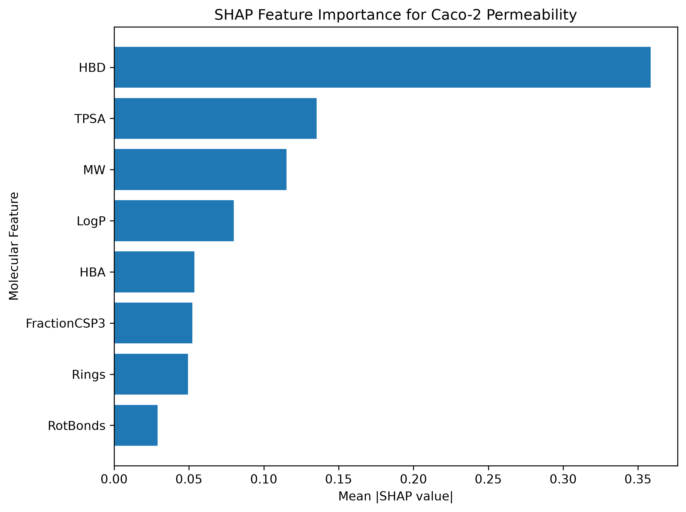

This analysis identifies which molecular descriptors have the greatest influence on model predictions.

---

## SHAP Summary

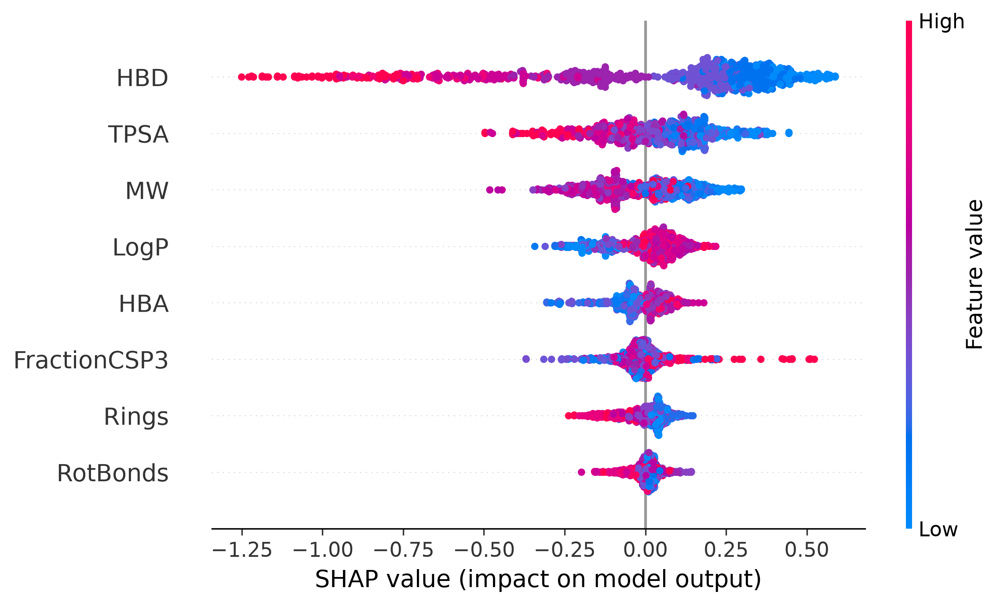

The SHAP summary provides both the relative importance of features and the direction of their contribution across individual molecules.

---

## HBD Dependence

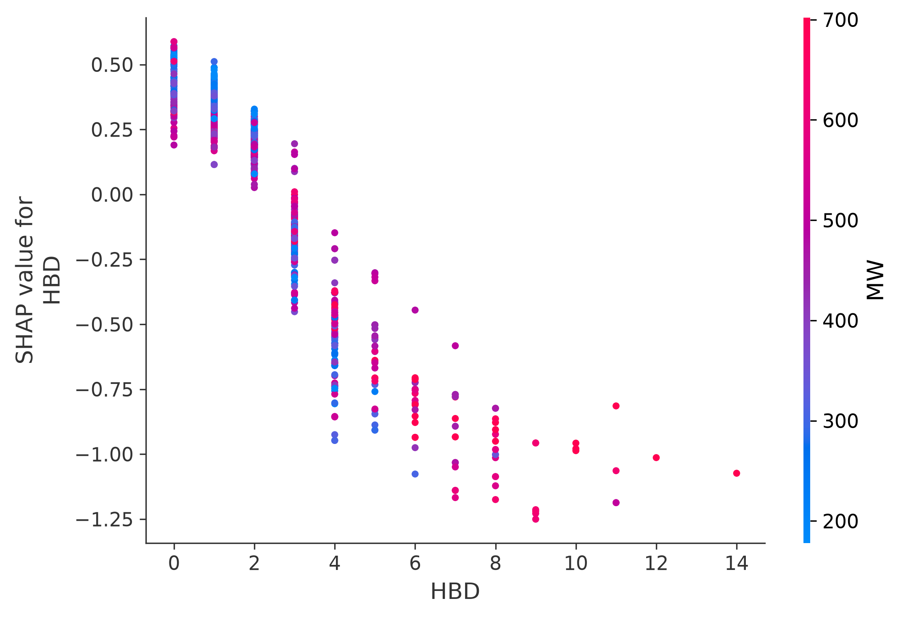

The HBD dependence analysis examines how hydrogen-bond donor count contributes to the model predictions and whether its effect varies across the molecular dataset.

---

# Morgan Fingerprint Interpretation

The model interpretation was extended beyond global molecular descriptors to investigate **local molecular environments encoded by Morgan fingerprints**.

Morgan fingerprints represent molecules as collections of atom-centered environments. Each fingerprint bit therefore represents a recurring structural environment generated from an atom and its surrounding neighborhood at a defined radius.

Because a fingerprint bit can occur in multiple molecules, and may occur at different structural contexts, the analysis treats fingerprint bits as **recurring molecular environments rather than unique chemical structures**.

---

## Selection of Morgan Fingerprint Features

Candidate fingerprint bits were evaluated using multiple complementary criteria:

* Random Forest feature importance
* Number of molecules containing the fingerprint bit
* Group-wise target comparison
* Incremental model performance
* Chemical-environment decoding

This multi-criterion analysis was used to identify fingerprint environments that were sufficiently represented in the dataset and potentially informative for model prediction.

The processed Morgan analysis files are available in:

```text
data/processed/morgan_incremental_r2.csv
data/processed/morgan_top_bits_summary.csv
data/processed/morgan_top_bits_decoded.csv
```

Additional statistical analysis files include:

```text
data/processed/morgan_bit_association.csv
data/processed/morgan_bit_statistical_analysis.csv
data/processed/morgan_bit_statistical_analysis_fdr.csv
data/processed/morgan_bit_adjusted_analysis.csv
data/processed/morgan_feature_importance.csv
```

The final interpretation tables are available in:

```text
results/morgan_bit_analysis/final_morgan_interpretability_table.csv
results/morgan_bit_analysis/final_morgan_chemical_environments.csv
```

---

## Morgan Fingerprint Interpretability

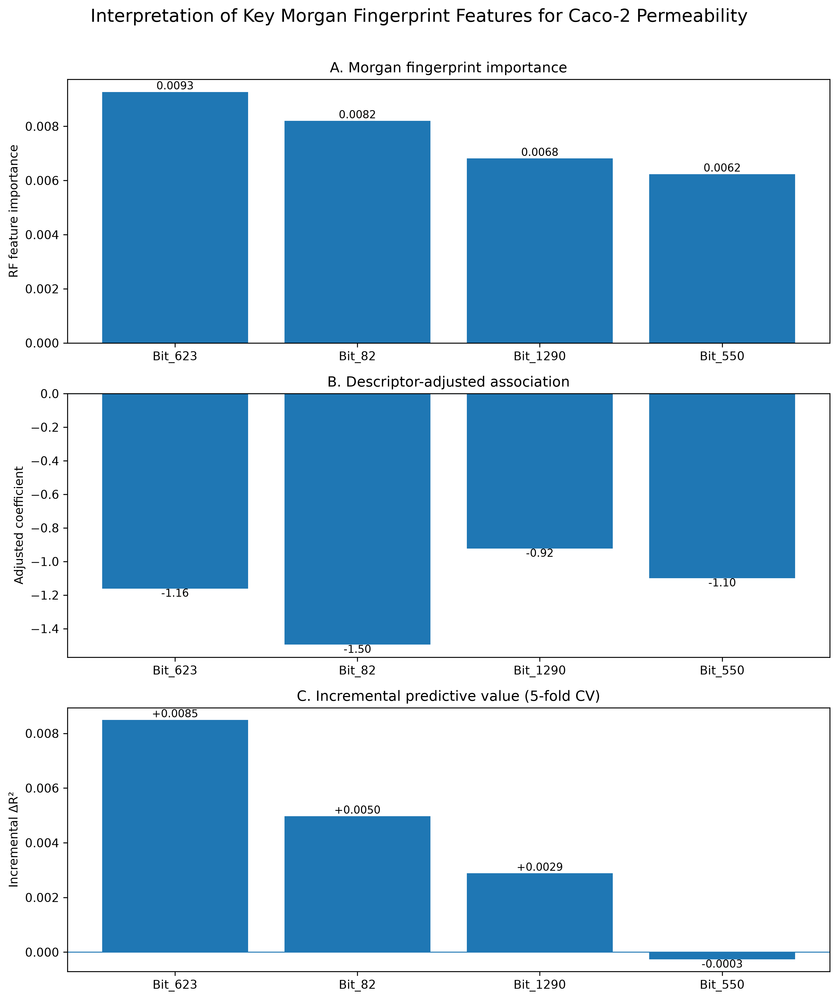

The Morgan fingerprint analysis provides a **local structural interpretation layer** that complements the global molecular-property interpretation obtained from SHAP.

The analysis connects:

```text
Morgan Fingerprint Bit
        ↓
Atom-Centered Environment
        ↓
Molecular Structure
        ↓
Model Importance / Association
        ↓
Chemical Interpretation
```

---

# Highlighted Morgan Fingerprint Environments

Four fingerprint bits were selected for detailed structural interpretation:

* **Bit 623**
* **Bit 82**
* **Bit 1290**
* **Bit 550**

The corresponding molecular environments were decoded using RDKit.

The decoded results show that these bits occur across multiple compounds rather than representing a single universal chemical structure.

---

## Bit 623

Bit 623 is observed across a diverse set of compounds and structural contexts.

Examples in the decoded dataset include creatinine, metolazone, PNU-series compounds, amiloride, several neolignans, rhodamine 123, and other molecules.

The bit occurs at different atom-centered environments, including radius 0, radius 1, and radius 2.

This diversity indicates that Bit 623 should be interpreted as a **recurring fingerprint environment encoded by the Morgan algorithm**, rather than as one specific functional group.

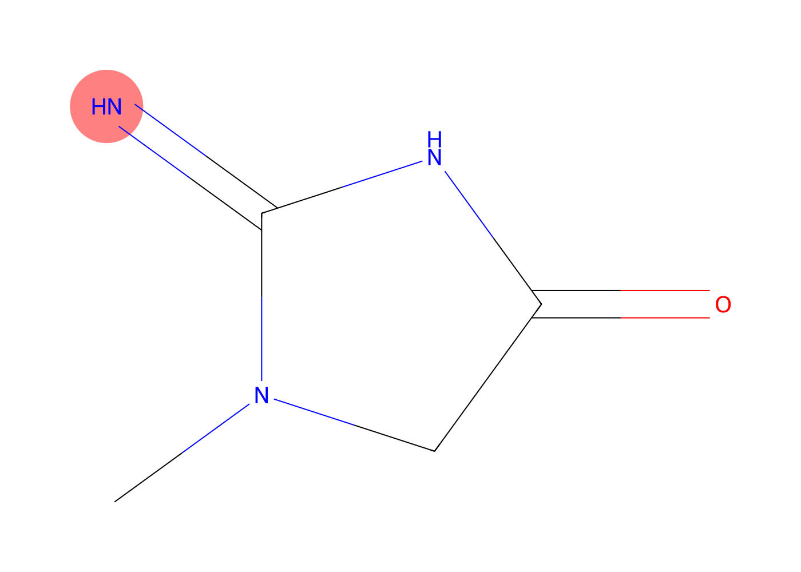

---

## Bit 82

Bit 82 is also observed across multiple molecules.

Examples include PNU-series compounds, digoxin, and several related permeability-model compounds.

In the decoded dataset, Bit 82 is frequently represented at **radius 2**, indicating that the fingerprint environment incorporates a broader local neighborhood than a radius-0 atom feature.

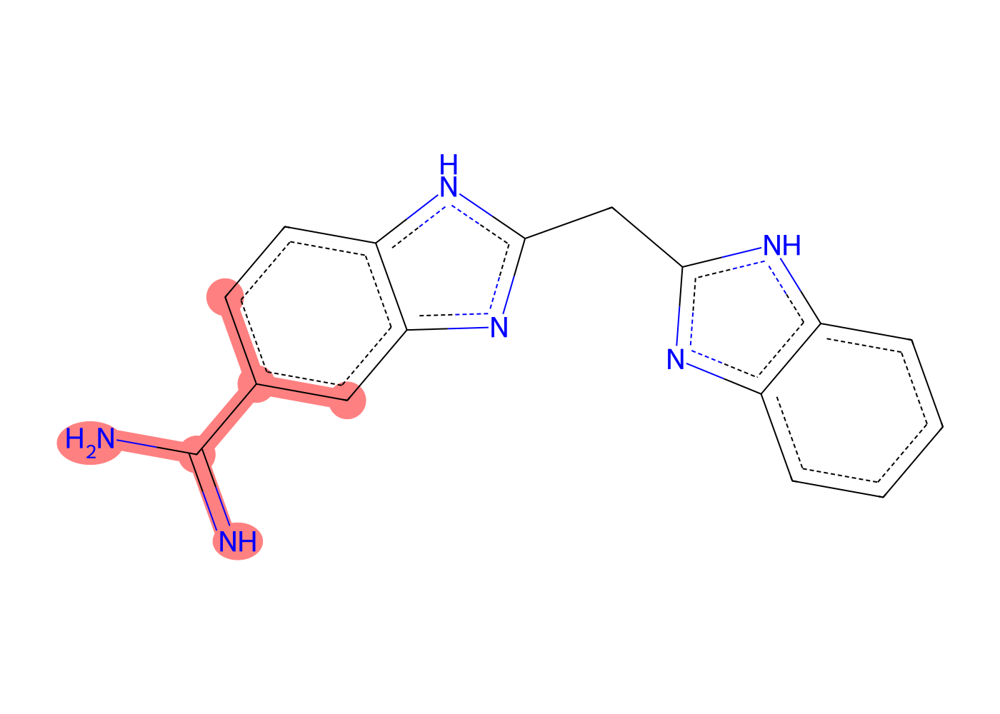

---

## Bit 1290

Bit 1290 occurs across several structurally diverse compounds, including pravastatin, atorvastatin, fluvastatin, saquinavir, biotin-saquinavir, peptide-like compounds, and other molecules.

Many occurrences are encoded at **radius 1**, representing an atom-centered environment involving the immediate neighboring atoms.

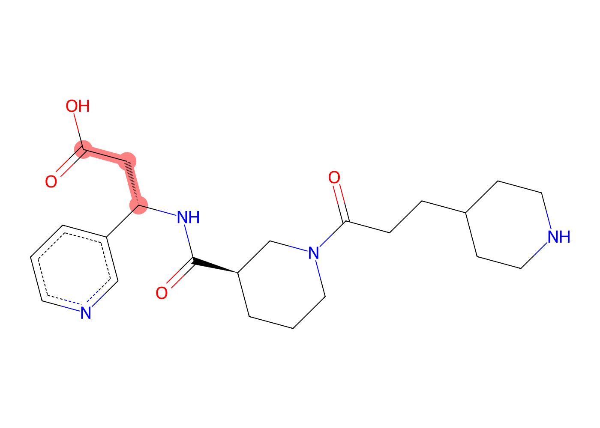

---

## Bit 550

Bit 550 is observed repeatedly in several chemically distinct molecules.

Examples include echinacoside, digoxin, ouabain, epimedin A/B, icariin, quercitrin, naringin, doxorubicin, daunorubicin, and other compounds.

A substantial number of the decoded occurrences correspond to **radius-2 environments**, capturing larger local structural neighborhoods.

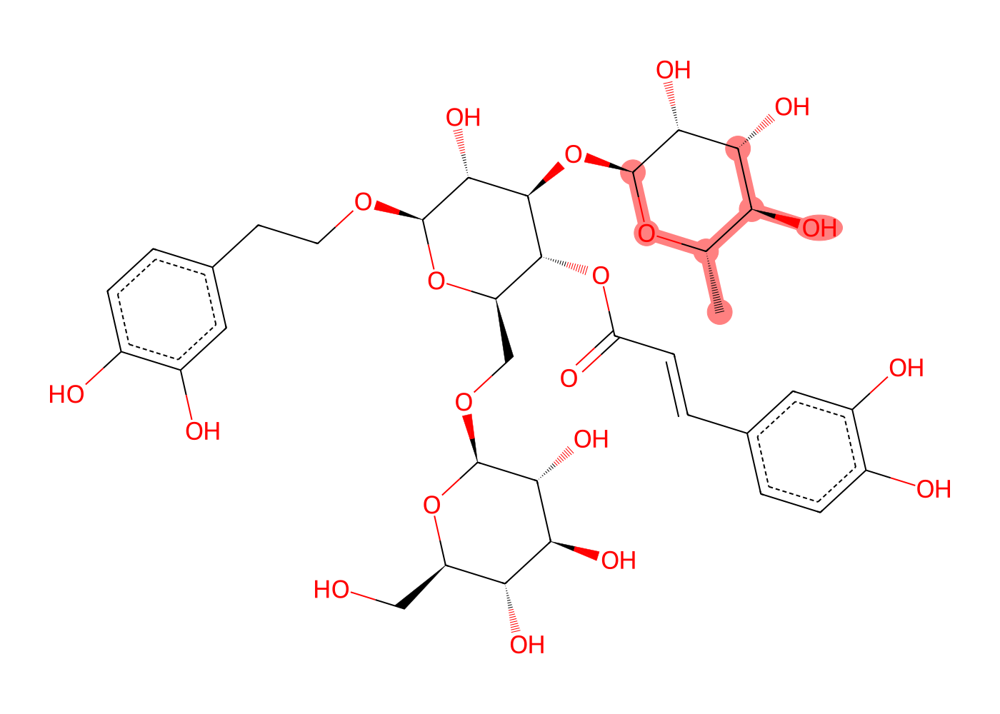

---

# Four-Panel Morgan Environment Visualization

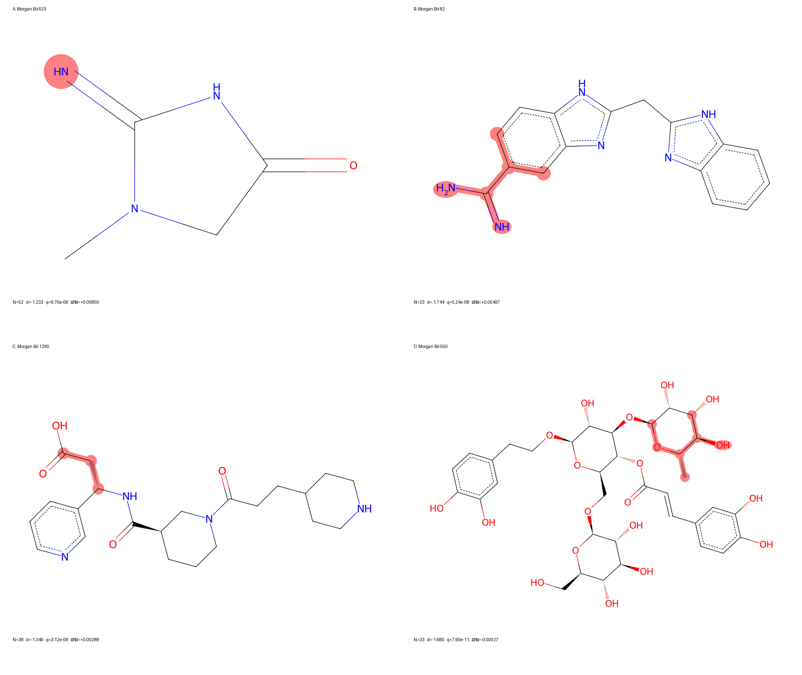

The four-panel visualization provides a compact comparison of the selected Morgan fingerprint environments.

This representation makes it possible to move from abstract fingerprint identifiers to visually interpretable molecular environments.

---

# Morgan Statistical Interpretation

The final Morgan interpretability analysis identified four highlighted fingerprint bits with strong statistical associations in the dataset.

| Bit          | RF Importance | N Present | Cohen's d |  FDR q-value | Adjusted Coefficient |      ΔR² |
| ------------ | ------------: | --------: | --------: | -----------: | -------------------: | -------: |
| **Bit 623**  |       0.00927 |        52 |    -1.233 |  6.70 × 10⁻⁹ |               -1.161 | +0.00850 |
| **Bit 82**   |       0.00820 |        23 |    -1.744 |  5.24 × 10⁻⁸ |               -1.496 | +0.00497 |
| **Bit 1290** |       0.00681 |        38 |    -1.349 |  3.12 × 10⁻⁹ |               -0.923 | +0.00288 |
| **Bit 550**  |       0.00623 |        33 |    -1.680 | 7.90 × 10⁻¹¹ |               -1.100 | -0.00027 |

These values are interpreted as statistical associations within the analyzed dataset rather than causal effects.

The complete table is available at:

```text
results/morgan_bit_analysis/final_morgan_interpretability_table.csv
```

---

# Chemical Interpretation

The Morgan analysis demonstrates that machine-learning models can use information from **local molecular structure** in addition to global physicochemical descriptors.

However, the fingerprint results should be interpreted carefully.

A Morgan bit does not necessarily correspond to one unique functional group or one unique chemical effect. The same bit may occur in different molecules and structural contexts because Morgan fingerprints encode atom-centered environments algorithmically.

Therefore:

> **An important Morgan bit represents a recurring structural environment associated with model behavior, rather than a single causal chemical motif.**

The observed association may also reflect correlated molecular properties such as:

* Molecular size
* Lipophilicity
* Hydrogen-bonding capacity
* Polarity
* Molecular flexibility
* Aromaticity
* Overall scaffold structure

Consequently, Morgan fingerprint analysis is best used to generate **chemically interpretable hypotheses** rather than causal conclusions.

---

# Global and Local Interpretability

The project combines two complementary explainability approaches.

| Interpretation level | Method              | Information provided                                |
| -------------------- | ------------------- | --------------------------------------------------- |
| Global               | RDKit descriptors   | Overall molecular properties                        |
| Global               | SHAP                | Magnitude and direction of descriptor contributions |
| Local                | Morgan fingerprints | Recurring atom-centered molecular environments      |
| Structural           | RDKit visualization | Visual interpretation of selected environments      |

This combination allows the model to be investigated from both a **physicochemical** and a **structural** perspective.

---

# Scaffold-Based Validation

Random cross-validation can provide optimistic estimates when structurally similar molecules are distributed across both training and validation folds.

To evaluate whether the model can generalize to chemically distinct molecular scaffolds, an additional **scaffold-based validation** was performed.

The dataset contained:

* **910 molecules**
* **488 unique molecular scaffolds**
* **390 training scaffolds**
* **98 validation scaffolds**
* **676 training molecules**
* **234 validation molecules**
* **0 scaffold overlap**
* **0 invalid molecular structures**

The scaffold leakage check passed, confirming that no molecular scaffold was shared between the training and validation sets.

The combined descriptor + Morgan representation was evaluated using a Random Forest model on the scaffold-based split.

## Scaffold Validation Results

| Metric        | Scaffold Validation |
| ------------- | ------------------: |
| R²            |          **0.6381** |
| RMSE          |          **0.4404** |
| MAE           |          **0.3466** |
| Residual Mean |             -0.0563 |
| Residual Std  |              0.4368 |

The scaffold-validation result is stored in:

```text
results/caco2_scaffold_validation.csv
```

The validation procedure is implemented in:

```text
src/07_scaffold_validation.py
```

---

## Random CV vs Scaffold Validation

| Evaluation             |                  R² |                RMSE |                 MAE |
| ---------------------- | ------------------: | ------------------: | ------------------: |
| Random 5-fold CV       | **0.7455 ± 0.0258** | **0.3895 ± 0.0217** | **0.3005 ± 0.0148** |
| Out-of-fold prediction |          **0.7230** |          **0.4089** |          **0.3177** |
| Scaffold validation    |          **0.6381** |          **0.4404** |          **0.3466** |

The reduction in R² from random cross-validation (**0.7455**) to scaffold validation (**0.6381**) indicates that prediction becomes more challenging when the model is evaluated on molecules containing scaffolds that were not represented during training.

This difference demonstrates why scaffold-aware validation is important for molecular machine-learning models.

Random splitting can place chemically related molecules in both training and validation sets, whereas scaffold splitting provides a more stringent assessment of generalization to structurally distinct chemistry.

Despite the reduction in performance, the model retains meaningful predictive ability on unseen scaffolds, with a scaffold-validation **R² of 0.6381**.

Therefore, the model demonstrates useful predictive performance within the chemical space represented by the dataset, while predictions for substantially novel molecular scaffolds should be interpreted with greater caution.

---

# Reproducibility

The complete analysis pipeline is organized into sequential scripts:

```text
src/
├── 01_download_data.py
├── 02_generate_descriptors.py
├── 03_generate_morgan.py
├── 04_model_comparison.py
├── 05_visualize_key_morgan_bits.py
├── 06_final_morgan_bit_figures.py
└── 07_scaffold_validation.py
```

The project dependencies are specified in:

```text
requirements.txt
```

The principal workflow is:

```text
Caco-2 Dataset
      │
      ▼
RDKit Molecular Descriptors
      │
      ├──────────────────┐
      │                  │
      ▼                  ▼
Morgan Fingerprints   Descriptor Features
      │                  │
      └─────────┬────────┘
                ▼
        Random Forest Models
                │
                ▼
         Model Comparison
                │
         ┌──────┴──────┐
         ▼             ▼
      Random CV    Scaffold Validation
         │             │
         └──────┬──────┘
                ▼
        Model Interpretation
        ┌───────┴────────┐
        ▼                ▼
       SHAP         Morgan Analysis
        │                │
        └───────┬────────┘
                ▼
       Chemical Interpretation
```

---

# Repository Structure

```text
admet-drug-discovery-ml/
│
├── data/
│   ├── raw/
│   │   └── caco2_wang.csv
│   ├── processed/
│   │   ├── caco2_rdkit_features.csv
│   │   ├── caco2_morgan_fingerprints.csv
│   │   ├── morgan_incremental_r2.csv
│   │   ├── morgan_top_bits_summary.csv
│   │   ├── morgan_top_bits_decoded.csv
│   │   ├── morgan_bit_statistical_analysis.csv
│   │   ├── morgan_bit_statistical_analysis_fdr.csv
│   │   └── morgan_bit_adjusted_analysis.csv
│   └── caco2_wang.tab
│
├── figures/
│   ├── caco2_shap_feature_importance.png
│   ├── caco2_shap_HBD_dependence.png
│   ├── caco2_shap_summary.png
│   ├── caco2_oof_predicted_vs_experimental.png
│   ├── caco2_oof_residuals.png
│   ├── caco2_5fold_cv_r2.png
│   └── caco2_model_representation_comparison.png
│
├── results/
│   ├── caco2_combined_oof_predictions.csv
│   ├── caco2_model_comparison.csv
│   ├── caco2_scaffold_validation.csv
│   ├── morgan_bit_analysis/
│   │   ├── final_morgan_interpretability_table.csv
│   │   ├── final_morgan_chemical_environments.csv
│   │   └── morgan_interpretability_figure.png
│   └── morgan_bit_visualizations/
│       ├── key_morgan_environments_4panel.png
│       ├── morgan_bit_623_EXACT.png
│       ├── morgan_bit_82_EXACT.png
│       ├── morgan_bit_1290_EXACT.png
│       └── morgan_bit_550_EXACT.png
│
├── src/
│   ├── 01_download_data.py
│   ├── 02_generate_descriptors.py
│   ├── 03_generate_morgan.py
│   ├── 04_model_comparison.py
│   ├── 05_visualize_key_morgan_bits.py
│   ├── 06_final_morgan_bit_figures.py
│   └── 07_scaffold_validation.py
│
├── .gitignore
├── requirements.txt
├── LICENSE
├── CITATION.cff
└── README.md
```

---

# Limitations

Several limitations should be considered when interpreting the results.

1. The dataset contains **910 molecules**, which limits the chemical diversity available for model development.
2. Random Forest performance depends on the molecular representations supplied to the model.
3. Random cross-validation may provide more optimistic estimates when related chemical structures occur across folds.
4. Scaffold validation produced lower performance than random cross-validation, indicating reduced generalization to unseen scaffolds.
5. Morgan fingerprint bits represent algorithmically generated atom-centered environments and should not automatically be interpreted as unique functional groups.
6. Feature importance and SHAP associations do not establish causal relationships between molecular properties and Caco-2 permeability.
7. The scaffold split represents a single validation partition and should not be interpreted as a complete characterization of performance across all possible chemical spaces.
8. The model is intended for research and hypothesis generation rather than direct experimental or clinical decision-making.

---

# Conclusion

This project developed a reproducible machine-learning workflow for predicting **Caco-2 permeability** from molecular structure.

Three molecular representations were evaluated:

* RDKit physicochemical descriptors
* Morgan fingerprints
* Combined RDKit descriptors + Morgan fingerprints

The combined representation produced the strongest random 5-fold cross-validation performance:

**R² = 0.7455 ± 0.0258**

with:

**RMSE = 0.3895 ± 0.0217**

and:

**MAE = 0.3005 ± 0.0148**

Out-of-fold evaluation across all 910 molecules produced:

**R² = 0.7230**

**RMSE = 0.4089**

**MAE = 0.3177**

A more stringent scaffold-based validation produced:

**R² = 0.6381**

**RMSE = 0.4404**

**MAE = 0.3466**

The reduction in performance under scaffold validation demonstrates that generalization to chemically novel molecular scaffolds remains more challenging than prediction under random splitting.

Model interpretation was performed using both **SHAP** and **Morgan fingerprint analysis**, providing complementary information about global physicochemical effects and recurring local structural environments.

Overall, the workflow demonstrates how molecular descriptors, structural fingerprints, rigorous validation, out-of-fold prediction, scaffold-aware evaluation, and explainability methods can be combined to develop a more transparent and reproducible ADMET machine-learning model.

---

# Citation

If you use this repository or methodology in academic work, please cite the associated project publication and dataset sources listed in `CITATION.cff`.

---

# License

This project is released under the **MIT License**.
